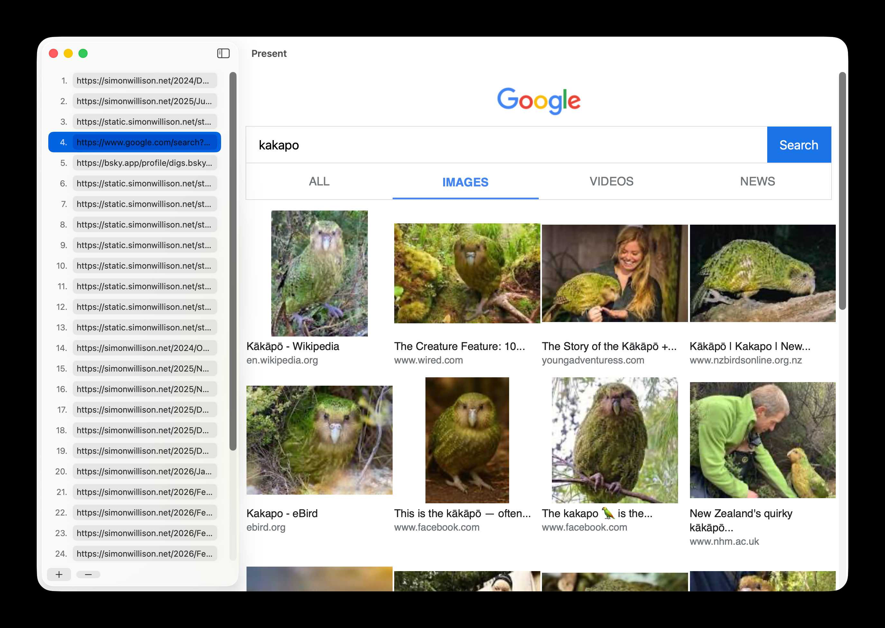
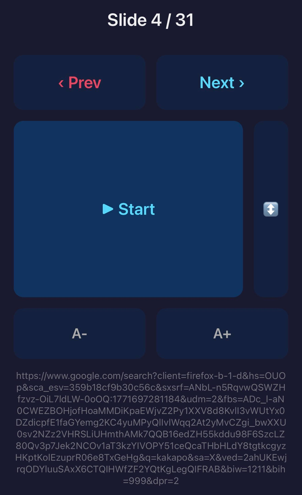

# Present

A macOS SwiftUI app for giving presentations where each slide is a URL displayed in a WebView.

> [!WARNING]  
> This app was vibe coded as a demo for a conference (where I presented a talk using this app). Here's [part of the transcript](https://gisthost.github.io/?bfbc338977ceb71e298e4d4d5ac7d63c). I do not know Swift or SwiftUI. I make no promises other than it worked on my machine!

## Features

- **Edit mode**: Split view with a sidebar for managing URLs and a WebView preview panel
- **Play mode**: Fullscreen WebView with arrow key navigation (wraps around)
- **Auto-persist**: URL list saves automatically and restores on relaunch
- **File I/O**: File > Open/Save As for plain text files (one URL per line)
- **Zoom**: Cmd+=/- to adjust text size in both preview and fullscreen
- **Drag to reorder**: Drag slides by their number to rearrange
- **Image slides**: URLs ending in `.png`, `.gif`, `.jpg`, `.jpeg`, `.webp`, or `.svg` render as full-window images
- **Remote control**: Embedded HTTP server on port 9123 serves a mobile-friendly page with next/prev, play/stop, zoom, and scroll controls

## Screenshots

<table>
  <tr>
    <td align="center">
      <br>
      <em>Desktop</em>
    </td>
    <td align="center">
      <br>
      <em>Mobile remote</em>
    </td>
  </tr>
</table>

## Building from the command line

Build and run without opening Xcode:

```bash
xcodebuild -project Present.xcodeproj -scheme Present -configuration Release build SYMROOT=build
open build/Release/Present.app
```

To clean the build:

```bash
rm -rf build
```

## Usage

1. Build and launch using the command above, or open `Present.xcodeproj` in Xcode and build/run (Cmd+R)
2. Add URLs in the sidebar, preview them in the right panel
3. **Presentation > Play** (Cmd+Shift+P) enters fullscreen
4. Left/Right arrow keys navigate between slides
5. Escape exits presentation mode

## File format

Presentation files are plain text with one URL per line:

```
https://example.com
https://github.com
https://simonwillison.net
```

## License

Apache License 2.0
